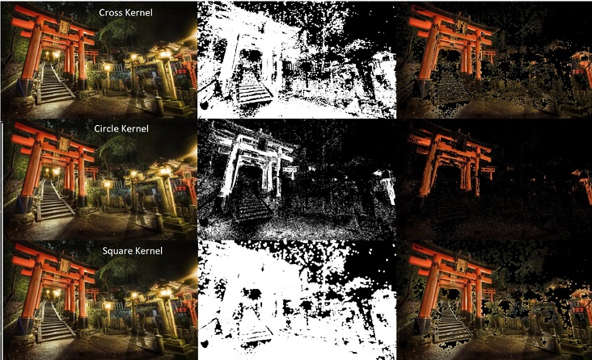
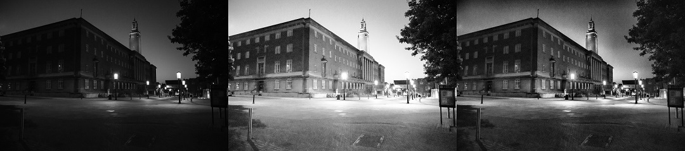
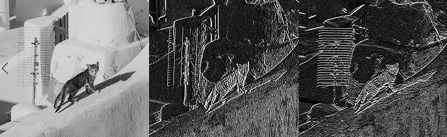
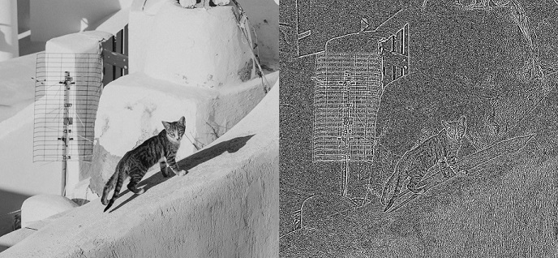
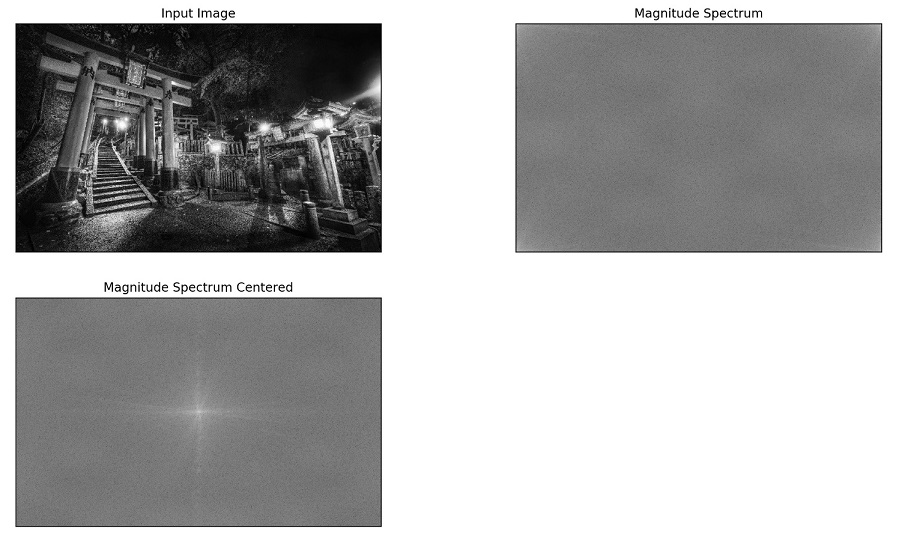
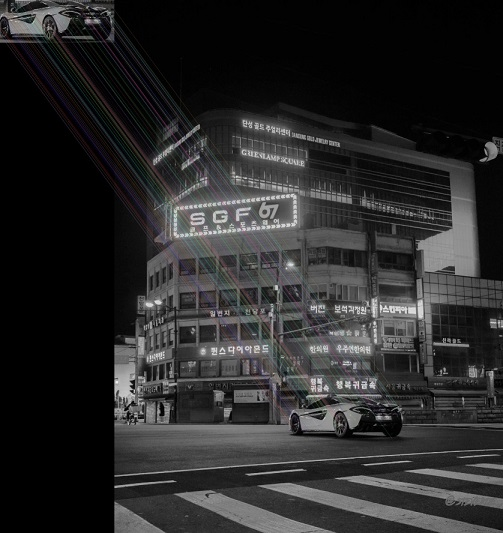

# TraditionalOpenCV
A demonstration of some computer vision/image processing techniques

## Histogram Backprojection
Looking for a sample of the red column.

## Histogram Equalization
Showing histogram equalization to improve lighting in an image and then adapative equalization applied to the R,G and B channels of an image separately to alter the colour balance.

## Edge Detection
Demonstrating Sobel edge detection along the X and Y axes and Laplacian edge detection.

## Operations in Frequency space using Fourier Transform
Visualising an image in frequency domain and then applying filters to that image before converting back to spatial domain.

  ## SIFT Feature Point Detection
Visualising a small sample of feature points detected using SIFT.

